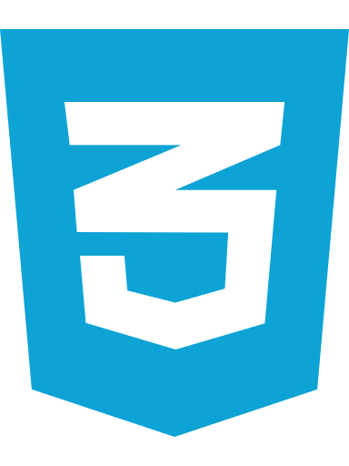
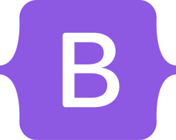
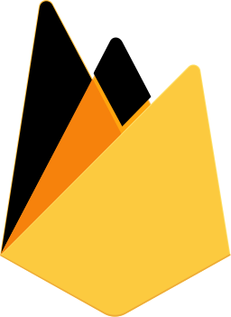
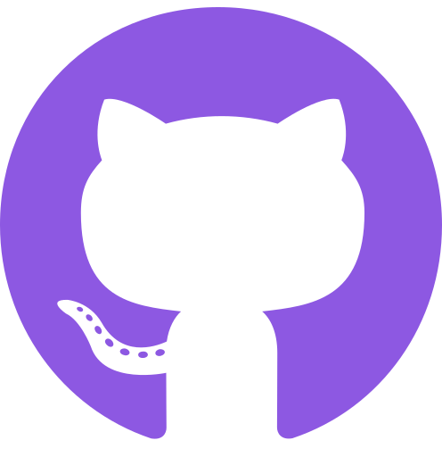
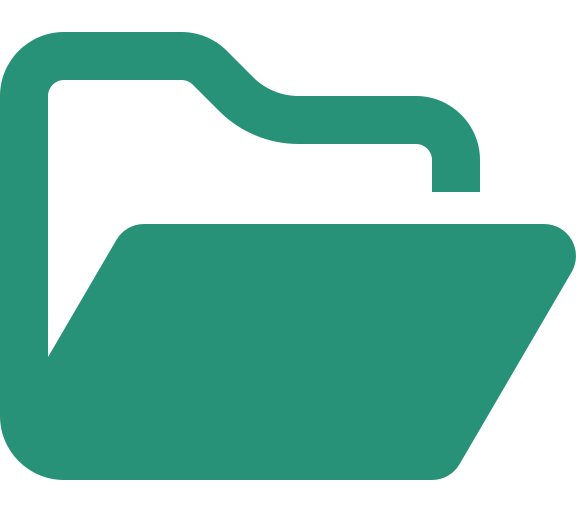

## Hi there &nbsp; 👋&nbsp;&nbsp;👩🏻‍🦰

<!--
**katieloesch/katieloesch** is a ✨ _special_ ✨ repository because its `README.md` (this file) appears on your GitHub profile.

Here are some ideas to get you started:

- 🔭 I’m currently working on ... a job application tracker
- 🌱 I’m currently learning ... python / typescript, linux
- 👯 I’m looking to collaborate on ... open source projects
- 🤔 I’m looking for help with ...
-> interest in AI
-->

 

I'm Katie. I'm a full-stack developer, currently based in London. I'm passionate about designing user-centric applications and building purpose-driven solutions. I'm always looking for opportunities where I can contribute, learn and grow.

 

---

<!--

- Blog
- github stats
- my coding journey

 -->

#### `> Languages & Tools ` &nbsp;&nbsp; 🛠️

 

|                            |                                                                                                                                                                                                                                                                                                                                                                                                                                                                                                                                                                                                                                                                                                                                                                                                             |
| -------------------------- | ----------------------------------------------------------------------------------------------------------------------------------------------------------------------------------------------------------------------------------------------------------------------------------------------------------------------------------------------------------------------------------------------------------------------------------------------------------------------------------------------------------------------------------------------------------------------------------------------------------------------------------------------------------------------------------------------------------------------------------------------------------------------------------------------------------- |
| front-end                  |   |
| back-end                   |                                                                                                                                                                                    |
| database + data management |  |
| development tools          |                                                                                      |
| currently learning         |                                                                                                                                                                                                                                                                              |

<!--

Projects

- browser arcade
- application tracker
- location app
- flicks 4 brains
- pet job board
- portfolio website

 -->
 

---

#### `> Connect with me `&nbsp;&nbsp;&nbsp;&nbsp;📫

 

To get in touch: &nbsp;&nbsp;&nbsp;&nbsp;&nbsp;&nbsp;&nbsp;&nbsp;&nbsp;&nbsp;&nbsp;&nbsp;&nbsp;&nbsp;&nbsp;&nbsp;&nbsp;&nbsp;&nbsp;&nbsp;&nbsp;&nbsp;&nbsp;&nbsp;&nbsp;&nbsp;&nbsp;&nbsp;&nbsp;&nbsp;&nbsp;&nbsp;&nbsp;&nbsp;&nbsp;&nbsp;&nbsp;&nbsp;&nbsp;&nbsp;&nbsp;&nbsp;

- visit my [portfolio website](https://katieloesch.co.uk/) and leave me a message there, I'm always happy to get feedback
- message me on [LinkedIn](https://www.linkedin.com/in/katie-loesch/)
- [email](mailto:katie.loesch@pm.me) me

 

---

 

#### `> Connect with me ` &nbsp;&nbsp;&nbsp;&nbsp;&nbsp;&nbsp;&nbsp;&nbsp;&nbsp;&nbsp;&nbsp;&nbsp;&nbsp;&nbsp;&nbsp;&nbsp;&nbsp;&nbsp;&nbsp;&nbsp;&nbsp;&nbsp;&nbsp;&nbsp;&nbsp;&nbsp;&nbsp;&nbsp;&nbsp;&nbsp;&nbsp;&nbsp;&nbsp;&nbsp;&nbsp;&nbsp;&nbsp;&nbsp;&nbsp;&nbsp;&nbsp;&nbsp;&nbsp;&nbsp;&nbsp;&nbsp;&nbsp;&nbsp;&nbsp;&nbsp;

 

How to get in touch &nbsp;&nbsp;📫

- visit my [portfolio website](https://katieloesch.co.uk/) and leave me a message there, I'm always happy to get feedback
- message me on [LinkedIn](https://www.linkedin.com/in/katie-loesch/)
- [email](mailto:katie.loesch@pm.me) me

 

---

#### `> Projects `&nbsp;&nbsp;&nbsp;&nbsp; :octocat: 📂

 

---

#### `> Stats `&nbsp;&nbsp;&nbsp;&nbsp;📊📈

Gotham

vue dark

Cobalt

transparent

custom

border_color

accent: #3da57a
secondary: #2e5355

<!--

 -->

 

---

#### `> Coding Journey `&nbsp;&nbsp;&nbsp;&nbsp;👩‍💻

#### Background 🧬🔬🧪🧫

As a biomedical science graduate, I had the opportunity to work with databases that store genetic data and algorithms for comparing sequence information. This experience sparked my interest in how software and technology can be used to improve and innovate healthcare and medical research.

My interest in coding led me to join the General Assembly software engineering immersive course to secure a solid foundation in programming fundamentals to build upon. I’m currently looking for opportunities to further develop my skills and learn new languages, frameworks and technologies.

#### Interests 👽 🛸 🖖

I'm fascinated by sci-fi books, movies, and TV shows like Star Trek and Black Mirror that have often predicted technological advancements before they became mainstream, such as video calls, mobile phones, wireless headphones, credit cards, solar power and AI.
