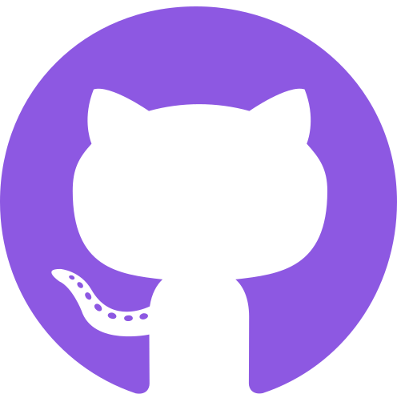

## Hi there &nbsp; 👋🏻&nbsp;&nbsp;👩🏻‍🦰

 

I'm Katie. I'm a full-stack developer, currently based in London.&nbsp; 🇬🇧 

 I'm always looking for opportunities where I can contribute, learn and grow. &nbsp; 🌱

 

### 🛠️&nbsp;&nbsp;&nbsp;Languages & Tools

 

|                            |                                                                                                                                                                                                                                                                                                                                                                                                                                                                                                                                                                                                                                                                                                                                                                                                                                                                                                                                                                                                                                                                                                                                                                                                                                                                                                                                                                                                                                                                                                                                                                                                                                                                                                                                                                                                                                                                                                                                                                                                                                                                                                                                                    |
| -------------------------- | -------------------------------------------------------------------------------------------------------------------------------------------------------------------------------------------------------------------------------------------------------------------------------------------------------------------------------------------------------------------------------------------------------------------------------------------------------------------------------------------------------------------------------------------------------------------------------------------------------------------------------------------------------------------------------------------------------------------------------------------------------------------------------------------------------------------------------------------------------------------------------------------------------------------------------------------------------------------------------------------------------------------------------------------------------------------------------------------------------------------------------------------------------------------------------------------------------------------------------------------------------------------------------------------------------------------------------------------------------------------------------------------------------------------------------------------------------------------------------------------------------------------------------------------------------------------------------------------------------------------------------------------------------------------------------------------------------------------------------------------------------------------------------------------------------------------------------------------------------------------------------------------------------------------------------------------------------------------------------------------------------------------------------------------------------------------------------------------------------------------------------------------------- |
| frontend                   | &nbsp;&nbsp;&nbsp;&nbsp;&nbsp;&nbsp;&nbsp;&nbsp;&nbsp;&nbsp;&nbsp;&nbsp;&nbsp;&nbsp;&nbsp;&nbsp;&nbsp;&nbsp; |
| backend                    | &nbsp;&nbsp;&nbsp;&nbsp; &nbsp;&nbsp;                                                                                                                                                                                                                                                                                                                                                                                                                                                                                                                                                                                                                                                                                                                                                                                                                                                                                                                                                                                                                                                                                                                                                                                                                                                                               |
| database + data management |                                                                                                                                                                                                                                                                                                                                                                                                                                                                                                                                                                                                                                                                                                                                                                                                                                                                                                                                                                                                                                                                                                                                                                                                                                                                                                                                         |
| development tools          |                                                                                                                                                                                                                                                                                                                                                                                                                                                                                                                                                                                                                                                                                                                                                                                                                                                                                                                                                                                                                                                                                                                                                                                                                                                                                                                                                                                                                             |
| currently learning         |                                                                                                                                                                                                                                                                                                                                                                                                                                                                                                                                                                                                                                                                                                                                                                                                                                                                                                                                                                                                                                                                                                                                                                                                                                                                                                                                                                                                                                                                                                                                                                                                                     |

 

### 📊&nbsp;&nbsp;&nbsp;Stats

 

<!--

 -->

 

| Connect with me &nbsp;&nbsp;📫                                                                                                                                                                                                                                                                                                                                                                                                                                                                                                                                                                                                            |
| ----------------------------------------------------------------------------------------------------------------------------------------------------------------------------------------------------------------------------------------------------------------------------------------------------------------------------------------------------------------------------------------------------------------------------------------------------------------------------------------------------------------------------------------------------------------------------------------------------------------------------------------- |
| &nbsp;&nbsp;&nbsp;&nbsp;&nbsp;&nbsp;&nbsp;&nbsp;&nbsp;&nbsp;&nbsp;&nbsp;&nbsp;&nbsp;&nbsp;&nbsp;&nbsp;&nbsp;&nbsp;&nbsp;&nbsp;&nbsp;&nbsp;&nbsp;&nbsp;&nbsp;&nbsp;&nbsp;&nbsp;&nbsp;&nbsp;&nbsp;&nbsp;&nbsp;&nbsp;&nbsp; |

 

 <!--

 

How to get in touch &nbsp;&nbsp;📫

- visit my [portfolio website](https://katieloesch.co.uk/) and leave me a message there, I'm always happy to get feedback
- message me on [LinkedIn](https://www.linkedin.com/in/katie-loesch/)
- [email](mailto:katie.loesch@pm.me) me

 

#### `> Projects ` :octocat:
 

Projects

- browser arcade
- application tracker
- location app
- flicks 4 brains
- pet job board
- portfolio website
#### `> Coding Journey 👩‍💻`

#### 🧬&nbsp; Background

As a biomedical science graduate, I had the opportunity to work with databases that store genetic data and algorithms for comparing sequence information. This experience sparked my interest in how software and technology can be used to improve and innovate healthcare and medical research.

My interest in coding led me to join the General Assembly software engineering immersive course to secure a solid foundation in programming fundamentals to build upon. I’m currently looking for opportunities to further develop my skills and learn new languages, frameworks and technologies.

#### 🛸 &nbsp;Interests

I'm fascinated by sci-fi books, movies, and TV shows like Star Trek and Black Mirror that have often predicted technological advancements before they became mainstream, such as video calls, mobile phones, wireless headphones, credit cards, solar power and AI.
  -->
